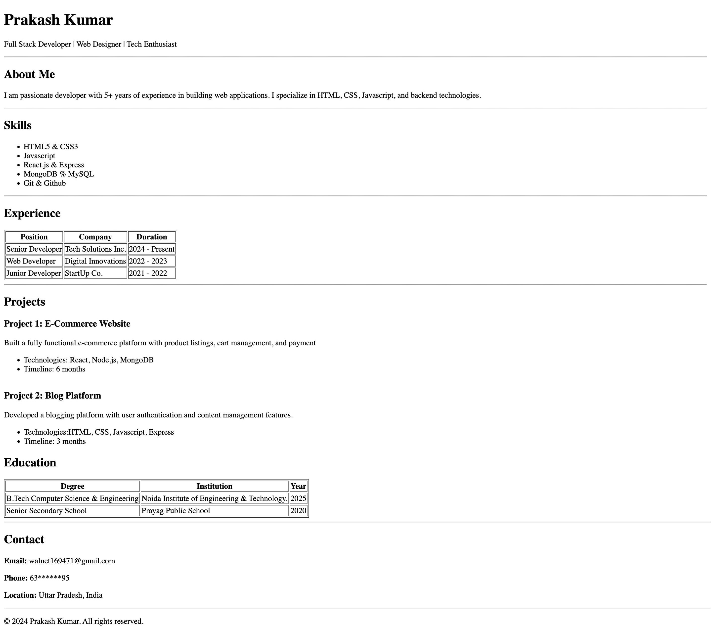
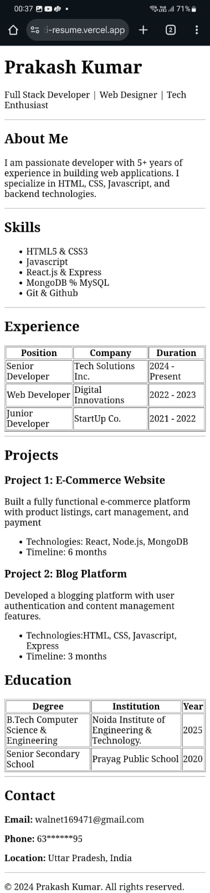

<div align="center">

# 👋 Hi, I’m Prakash Kumar

**Web Developer | HTML Enthusiast | Aspiring Frontend Developer**

[](https://prakashkprajapati-resume.vercel.app/)
[](https://github.com/Prakash-K-Prajapati/Resume)

</div>

---

## 🖼 About This Project

This repository contains multiple HTML projects, including my **single-page HTML resume** for the **Web Development Cohort 2026** assignment.

**Main Resume Page:** `my_resume.html`



**Focus of this project:**

* 👤 **Header / Name** – Displays name & title
* 📝 **About Me** – Brief personal introduction
* 💻 **Skills** – Technical skills list
* 📊 **Experience** – Work experience in **table format**
* 📂 **Projects** – Key projects with descriptions
* 🎓 **Education** – Academic achievements in **table format**
* 📬 **Contact** – Email, phone, and social links

> ⚠️ **Note:** Pure HTML project – no CSS used. Focus on semantic HTML and clean structure.

---

## 🛠 Built With

[](https://developer.mozilla.org/en-US/docs/Web/HTML)
[](https://vercel.com/)

---

## 📁 Repository Structure

```
Resume/
├─ public/
│   ├─ apple-touch-icon.png
│   ├─ blogpost.html
│   ├─ my_resume.html        # Main HTML resume page
│   ├─ portfolio.html
│   ├─ registration_form.html
│   ├─ screenshots/
│   │   ├─ desktop-view.png
│   │   └─ mobile-view.png
│   └─ profile.png           # Profile photo
├─ abc.html
├─ .gitignore
├─ LICENSE
├─ vercel.json
└─ README.md
```

---

## 🚀 Live Demo

Check out the deployed resume:
[🌐 View Resume](https://prakashkprajapati-resume.vercel.app/)

---

## 🖥 Screenshots

**Desktop View**


**Mobile View**


---

## 🏗 How to Run Locally

1. **Clone the repo**

```bash
git clone https://github.com/Prakash-K-Prajapati/Resume.git
```

2. **Navigate to the `public` folder**

```bash
cd Resume/public
```

3. **Open `my_resume.html` in your browser**
   Double-click or right-click → Open with → Browser

> ✅ No setup required. Pure HTML project.

---

## 🌟 Learning Outcomes

* Practiced **semantic HTML structure**
* Learned to **organize content** with headings, lists, tables, and paragraphs
* Built a **professional-looking resume** without CSS
* Deployed a static page using **Vercel**

---

## 🌐 Socials:
[](https://instagram.com/prajapatisristpvt) [](https://linkedin.com/in/prakash-k-prajapati) [](https://x.com/Prakash_twts) [](https://codepen.io/https://codepen.io/cosfinix) [](mailto:walnet169471@gmail.com) 

---

## 🎯 Future Enhancements

* 🎨 Add **CSS styling** for modern look
* 📄 Include **downloadable PDF** option
* 📱 Make layout fully **responsive** using Flexbox/Grid

---
## 💰 You can help me by Donating
  [](https://buymeacoffee.com/prakash.k.prajapati) 

<div align="center">

### ⭐ Thank you for visiting my repository!

Feel free to fork, clone, or leave feedback.

</div>